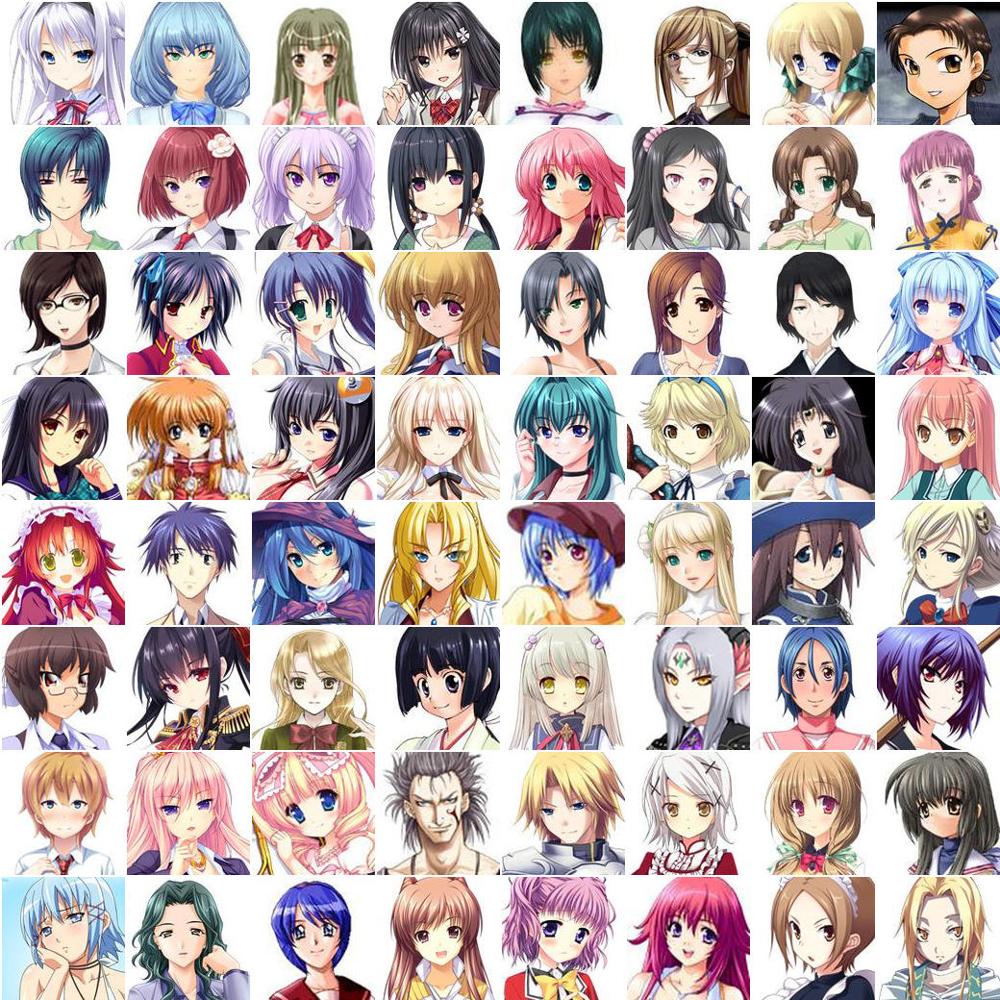

# Draw Anime with GAN

> Implementation of DCGAN and DRAGAN in PyTorch to draw anime faces


### Background
Most of the code is based on [animeGAN](https://github.com/jayleicn/animeGAN) and it started off from experimenting with his project. However, I realized that his dataset consists of many bad images. I thus wrote a simple script image_check.py to remove images that does not have faces and black and white images. Still, the results are not optimistic due to the bad quality images from [danbooru.donmai.us](http://danbooru.donmai.us/).

### Model
For my vanilla version, I use a DCGAN but instead of a deconvolution to upsample the image, I used PixelShuffle which has shown great result. I've also implemented [DRAGAN](https://github.com/kodalinaveen3/DRAGAN) which uses a gradient penalty. I am still experimenting with DRAGAN but preliminary results are bad and could be due to the small dataset. I've also implemented a rough version of an [SRResnet](https://github.com/kodalinaveen3/DRAGAN) which I've yet to test due to hardware constraints.

This is a result from DCGAN with PixelShuffle at about epoch.


### Dataset

The custom dataset consists of about 12,000 images scraped from [www.getchu.com](http://www.getchu.com/) using a customized version of the crawler [imagebot](https://github.com/amol9/imagebot/). The size of the dataset is due to my bandwidth constraint and lack of time. I am not very familiar with the scraper so my code is kind of a hack. To save myself from embarassment I will not upload my crawler. Also, I would be happy to upload the dataset. However, I am unsure if it will get me into any trouble with copyright issues or anything.




### Usage

To run the experiment, for DCGAN with PixelShuffle and noise of dimension 100,

```bash
$ python main.py --pix_shuf=1 --model='DCGAN' --outDir='./some_directory' --nz=100
```

