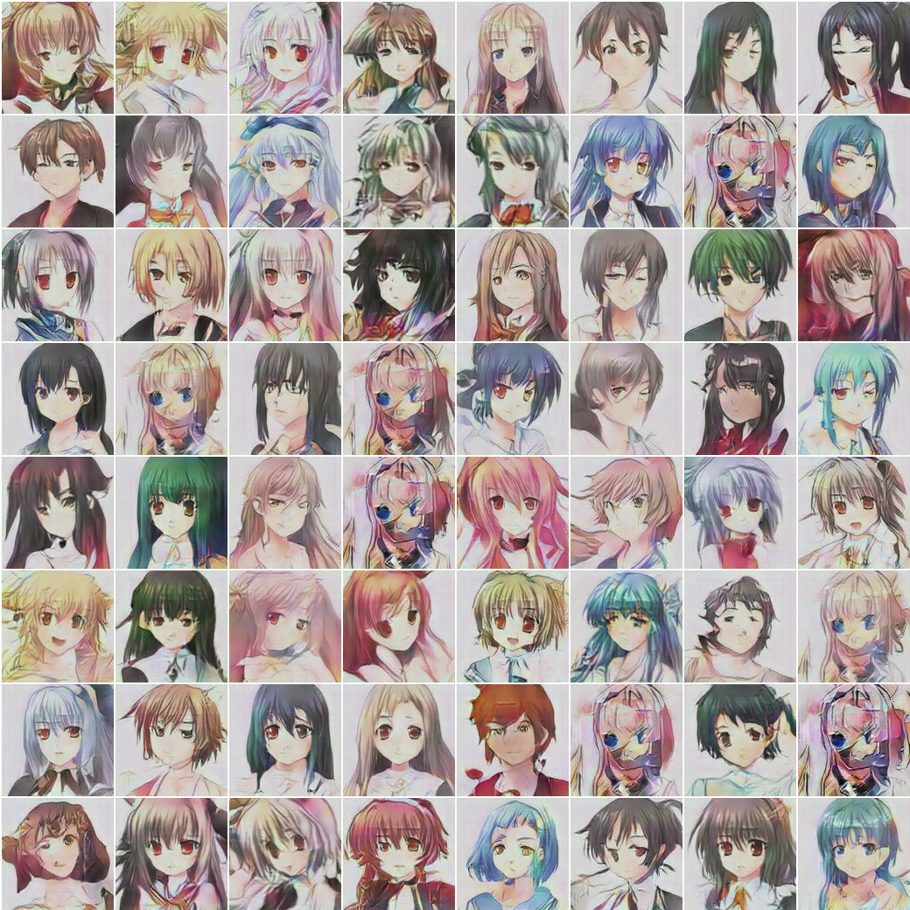
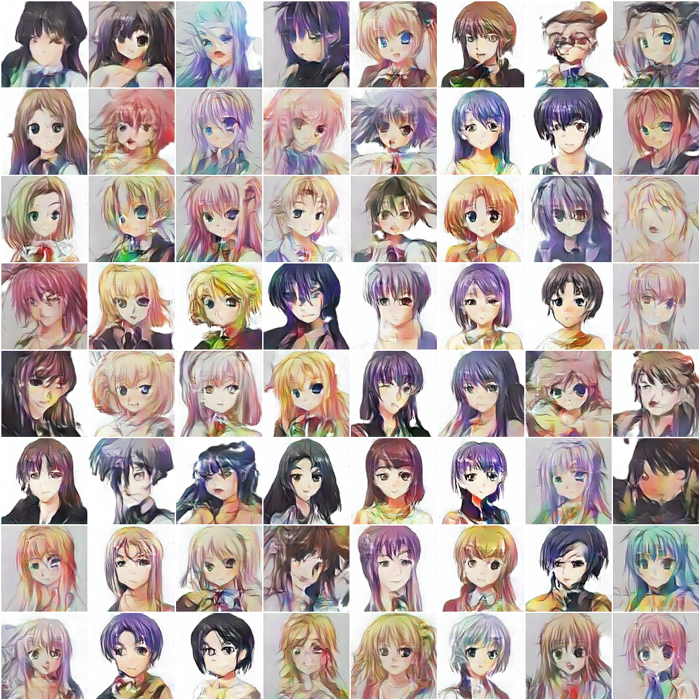
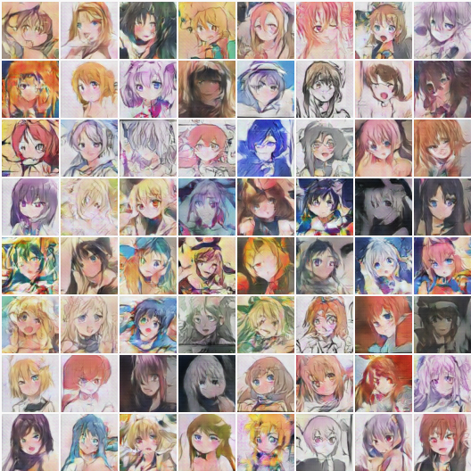
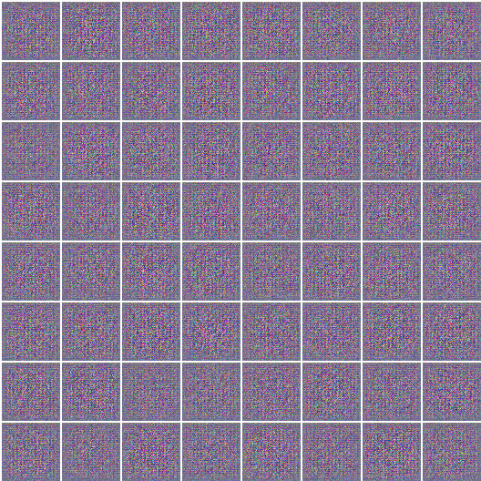

# Draw Anime with GAN

> Implementation of DCGAN and DRAGAN in PyTorch to draw anime faces


### Background
Most of the code is based on [animeGAN](https://github.com/jayleicn/animeGAN) and it started off from experimenting with his project. However, I realized that his dataset consists of many bad images. I thus wrote a simple script image_check.py to remove images that does not have faces and black and white images. Still, the results are not optimistic due to the bad quality images from [danbooru.donmai.us](http://danbooru.donmai.us/). I thus decided to create my own dataset following inspiration from [MakeGirls.moe](https://github.com/makegirlsmoe/makegirls.moe_web).

### Model
For my vanilla version, I use a DCGAN but instead of a deconvolution to upsample the image, I used PixelShuffle which has shown great results. I've also implemented [DRAGAN](https://github.com/kodalinaveen3/DRAGAN) which uses a gradient penalty. I've also implemented a rough version of an [SRResnet](https://github.com/kodalinaveen3/DRAGAN) which I've yet to test due to hardware constraints.

This is a result from DCGAN with PixelShuffle after about 300 epochs.



This is a result from DRAGAN with PixelShuffle after about 500 epochs.



We can see that with DRAGAN, there is no mode collapse. However, the image quality is slightly worse than the DCGAN version. I also found DRAGAN took longer to obtain a decent result and require a lower learning rate at 5e-5. Training at the same learning rate as the DCGAN version gave me bad results and mode collapse.

### Dataset

The custom dataset consists of about 12,000 images scraped from [www.getchu.com](http://www.getchu.com/) using a customized version of the crawler [imagebot](https://github.com/amol9/imagebot/). The size of the dataset is due to my bandwidth constraint and lack of time. I am not very familiar with the scraper so my code is kind of a hack. To save myself from embarassment I will not upload my crawler. Also, I would be happy to upload the dataset. However, I am unsure if it will get me into any trouble with copyright issues or anything.


### Usage

To run the experiment, for DCGAN with PixelShuffle and noise of dimension 100,

```bash
$ python main.py --pix_shuf=1 --model='DCGAN' --outDir='./some_directory' --nz=100
```

### Importance of Dataset
Using the exact same model, I also trained on the dataset used by [animeGAN](https://github.com/jayleicn/animeGAN). However, due to the dataset being 64x64, my model also generated output of 64x64. I cleaned the dataset further by removing bad faces, pruning the dataset from 143,000 images to around 100,000 images. The following is the generated image after 100 epochs of training with DCGAN and PixelShuffle.





With a cleaned up dataset and PixelShuffle, I felt that my output is better than the one generated by animeGAN, however, it still pales in comparison with the ones generated with my new dataset. With more time and bandwith, I will hopefully be able to scrape more data and obtain a better dataset.

### Problems faced
When training DCGAN with [animeGAN](https://github.com/jayleicn/animeGAN)'s dataset or my original scraped dataset, there were no signs of mode collapse. However upon cleaning up my dataset by removing around 100+ bad images, I found that DCGAN started to model collapse. The reason could be that since the dataset is good, the discriminator can easily be trained and causes instability due to non-overlapping supports of the two distributions. To counter that, I added a small amount of noise to the inputs of the discriminator.
